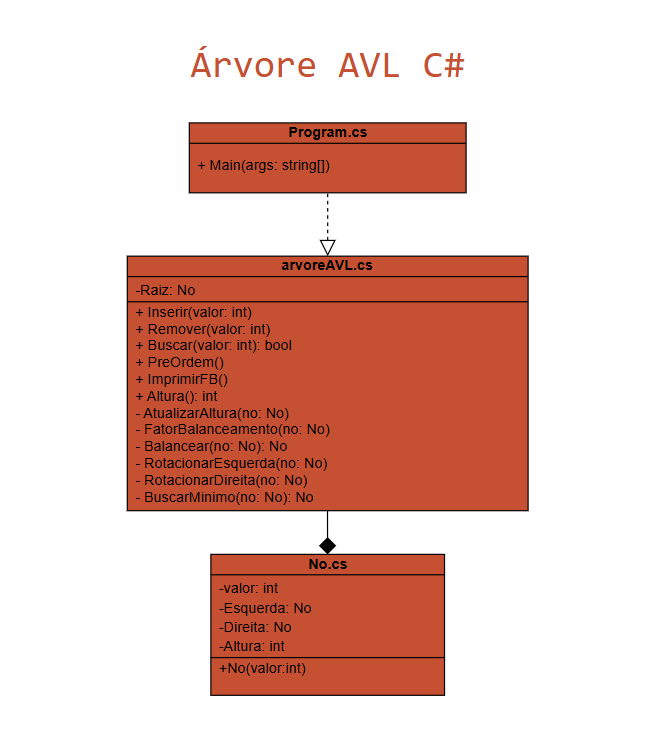

# 🌳 Projeto AVL Tree em C#

📁 Repositório: [https://github.com/ArlysonSilva/avl-tree-csharp](https://github.com/ArlysonSilva/avl-tree-csharp)

## 📌 Descrição

Este projeto implementa uma **árvore binária de busca balanceada AVL** em C#, utilizando o paradigma de **programação orientada a objetos**. O programa realiza **inserção**, **remoção**, **busca**, impressão em **pré-ordem**, exibição dos **fatores de balanceamento** de cada nó e a **altura total da árvore**.

Todas as operações são feitas com base em comandos contidos no arquivo `entrada.txt`.

---

## ⚙️ Como executar

1. Clone o repositório:

```bash
git clone https://github.com/ArlysonSilva/avl-tree-csharp.git
cd avl-tree-csharp
````

2. Crie um arquivo `entrada.txt` com os comandos desejados:

```
I 10
I 20
B 10
R 20
P
F
H
```

3. Compile e execute o programa com o .NET CLI:

```bash
dotnet run
```

---

## 🧾 Comandos disponíveis

| Comando | Ação executada                            |
| ------: | ----------------------------------------- |
|   `I x` | Insere o valor `x` na árvore              |
|   `R x` | Remove o valor `x` da árvore              |
|   `B x` | Busca o valor `x` e mostra se existe      |
|     `P` | Imprime a árvore em pré-ordem             |
|     `F` | Exibe o fator de balanceamento de cada nó |
|     `H` | Mostra a altura da árvore                 |

---

## 🧠 Aplicação de Programação Orientada a Objetos (POO)

O projeto segue os princípios da programação orientada a objetos:

* **Encapsulamento**: as classes isolam responsabilidades específicas (`No` representa o nó da árvore e `arvoreAVL` cuida da lógica AVL).
* **Modularidade e Reuso**: o código é organizado de forma coesa, com métodos reutilizáveis como `Inserir`, `Remover`, `Buscar`, `RotacionarEsquerda` e `RotacionarDireita`.
* **Coesão**: cada classe tem uma responsabilidade clara.
* **Abstração**: a complexidade do balanceamento AVL é abstraída dentro da classe `arvoreAVL`, permitindo que o `program.cs` funcione como interface simples com o usuário.

---

## 🧩 Estrutura do Projeto

```
avl-tree-csharp/
├── arvoreAVL.cs      // Classe principal da árvore AVL
├── no.cs             // Classe do nó da árvore
├── program.cs        // Lê e executa os comandos
├── entrada.txt       // Arquivo com comandos de teste
├── diagrama.png      // Diagrama UML do projeto
└── README.md         // Este arquivo
```

---

## 📐 Diagrama UML

O diagrama abaixo ilustra a relação entre as classes `No`, `arvoreAVL` e `Program`.



* A classe `Program` tem **dependência** com `arvoreAVL`.
* A classe `arvoreAVL` tem uma **composição** de nós (`No`).
* `No` é usado internamente como estrutura da árvore.

---

## ✅ Exemplo de entrada (`entrada.txt`)

```txt
I 30
I 15
I 45
I 10
I 20
P
F
B 20
R 15
P
H
```

Saída esperada:

```
Árvore em pré-ordem: 30 15 10 20 45
Fatores de balanceamento:
Nó: 30, Fator de Balanceamento: 1
Nó: 15, Fator de Balanceamento: 0
Nó: 10, Fator de Balanceamento: 0
Nó: 20, Fator de Balanceamento: 0
Nó: 45, Fator de Balanceamento: 0
Valor encontrado
Árvore em pré-ordem: 30 20 10 45
Altura da árvore: 3
```

---

## 👨‍💻 Integrantes

* **Kauan Melo** — RA: 113471
* **Arlyson Silva** — RA: 113627
* **Richard Nicholas Rocha** — RA: 113760

---

## 📄 Licença

Este projeto tem fins exclusivamente educacionais e está licenciado sob a licença MIT.
